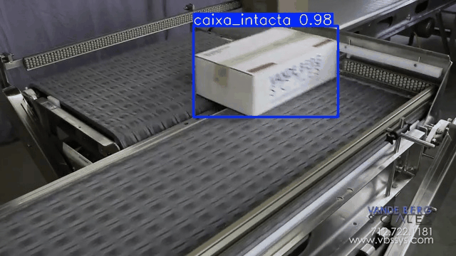
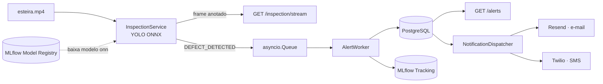
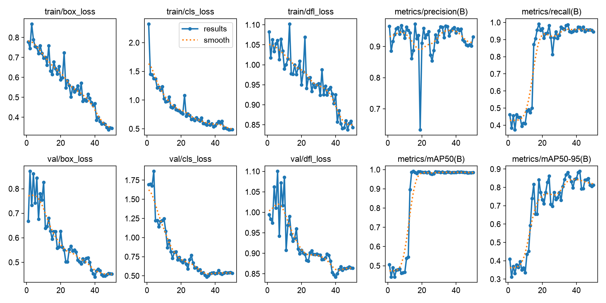
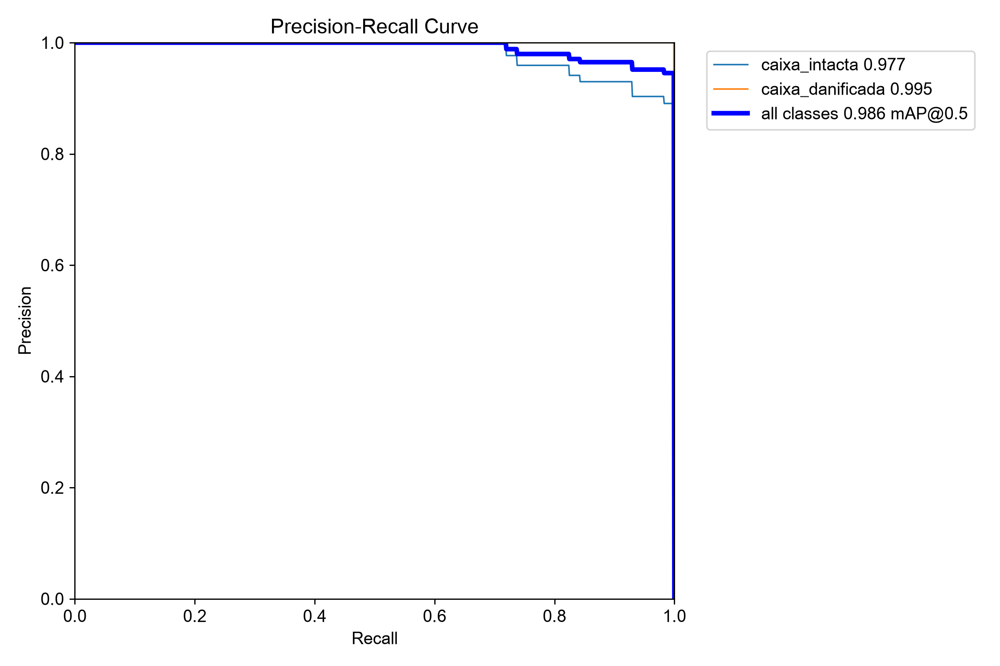
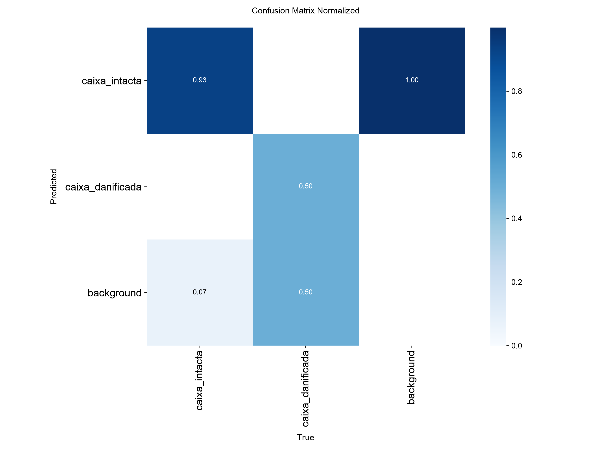

# Logistics AI - Visão Computacional

Sistema de inspeção visual de caixas numa esteira, em tempo real: um vídeo é processado quadro a quadro por um modelo YOLOv8 treinado do zero, que detecta a presença de caixas e classifica se estão intactas ou danificadas. Detecções de defeito geram alerta, ficam disponíveis via API e disparam notificação por e-mail e SMS.



## Arquitetura



A API (FastAPI) lê o vídeo, roda inferência a cada N quadros e mantém o último quadro anotado num buffer thread-safe, servido ao vivo via MJPEG. Detecções de defeito viram eventos numa fila assíncrona, consumidos por um worker que persiste no Postgres e registra métricas no MLflow. Um dispatcher separado agrega alertas por janela de tempo e distribui para canais de notificação plugáveis (e-mail e SMS hoje, com interface pronta pra novos canais).

## Features

- Inferência em tempo real sobre stream de vídeo, com endpoint de visualização ao vivo (MJPEG)
- Detecção de defeito por classe (não por limiar de confiança arbitrário)
- Registro e versionamento de modelo via MLflow Model Registry
- API de consulta de alertas com filtro e paginação
- Notificação multi-canal (e-mail via Resend, SMS via Twilio) com resumo agregado por janela, não por evento individual
- Pipeline de dados reprodutível: split treino/validação com seed fixa, conversão de anotações, extração de quadros na mesma cadência da inferência

## Resultados do modelo

Progressão real ao longo do desenvolvimento — cada linha corresponde a uma correção de pipeline, não só mais treino:

| Versão | Mudança | Precisão | Recall | mAP50 | mAP50-95 |
|---|---|---|---|---|---|
| v1-7 | Split treino/validação corrigido (antes validava em cima do próprio treino) | 0.939 | 0.900 | 0.970 | 0.873 |
| v1-9 | Dataset ampliado (58→203 imgs) + bug de formato de anotação corrigido | 0.918 | 0.949 | 0.975 | 0.912 |
| v1-11 | Classe `caixa_danificada` adicionada (detecção de defeito real) | 0.951 | 0.971 | 0.986 | 0.888 |

**Validação em produção**: a correção de pipeline (não só o treino) reduziu falsos alertas em ~35% no mesmo vídeo de teste (39 → 26 alertas), medido antes/depois em ambiente real, não só em métrica de validação.

**Modelo em produção**: `yolov8n` exportado pra ONNX (11.7 MB), rodando em CPU via ONNX Runtime — ~15.6ms de inferência por imagem, sem depender de GPU.


*`recall`, `mAP50` e `mAP50-95` ficam travados até ~época 13 e saltam junto, assinatura de um modelo "engatando" numa classe rara (só 9 exemplos de `caixa_danificada`). `train/*_loss` e `val/*_loss` caem em paralelo, sem a validação divergir do treino — sinal de que o split de validação (corrigido nesse projeto) está fazendo o trabalho de detectar overfitting.*

<p>
  
  
</p>

*`caixa_danificada` tem só 2 instâncias no conjunto de validação, a curva quase perfeita (AP=0.995) reflete isso. Sinal mais confiável: zero confusão entre as duas classes reais na matriz (todo erro é "não detectou" ou "falso alarme", nunca "confundiu uma classe com a outra").*

## Performance da API

Benchmark real (`ab`, endpoint `GET /alerts` com paginação, consultando Postgres via pool de conexões):

| Concorrência | Requisições | Req/s | p50 | p95 | p99 | Falhas |
|---|---|---|---|---|---|---|
| 10 | 300 | 1.383 | 6ms | 12ms | 21ms | 0 |
| 50 | 1.000 | 1.515 | 30ms | 43ms | 74ms | 0 |

## Desafios técnicos

Alguns problemas reais encontrados e corrigidos durante o desenvolvimento — a parte que mais importou, não só treinar o modelo:

- **Event loop bloqueado sob carga**: a leitura de vídeo e a inferência rodavam direto numa coroutine async. Funcionava localmente, mas travava a API inteira dentro do container Docker. Corrigido movendo o processamento pra uma thread separada (`asyncio.to_thread`), com handoff thread-safe pra fila de eventos.
- **Anotações descartadas silenciosamente**: parte do dataset foi rotulada como polígono, parte como bounding box. O Ultralytics, ao encontrar os dois formatos misturados, descartava as anotações em polígono sem erro visível — um terço do dataset treinava sem nenhuma label. Corrigido convertendo tudo pra um formato único antes do treino.

## Como rodar

```bash
git clone <repo>
cd logistics-ai
docker-compose up --build
```

Serviços: API em `localhost:8000` (`/docs` pra Swagger), MLflow em `localhost:5005`, Postgres em `localhost:5432`.

```bash
curl -X POST http://localhost:8000/api/v1/inspection/start
# stream ao vivo:
open http://localhost:8000/api/v1/inspection/stream
```

## Treinamento e retreino do modelo

O treino roda fora do Docker (usa GPU local via MPS/CUDA quando disponível), num ambiente conda com as mesmas dependências do `requirements.txt`:

```bash
conda create -n logistics-ai python=3.11
conda activate logistics-ai
pip install -r requirements.txt

python scripts/extract_frames.py     # extrai frames do vídeo bruto
python scripts/split_dataset.py      # split treino/validação reprodutível (seed fixa)
python model-training/train.py       # treina o YOLOv8n
python scripts/export_onnx.py        # exporta pra ONNX
python scripts/registry_model.py     # registra no MLflow Model Registry
```

## Stack

- **API**: FastAPI, Uvicorn, asyncpg (pool de conexões), Pydantic
- **ML**: Ultralytics YOLOv8, ONNX Runtime, MLflow (tracking + model registry)
- **Dados**: PostgreSQL, Roboflow (anotação)
- **Notificação**: Resend (e-mail), Twilio (SMS)
- **Infra**: Docker Compose, Conda (ambiente de treino)
